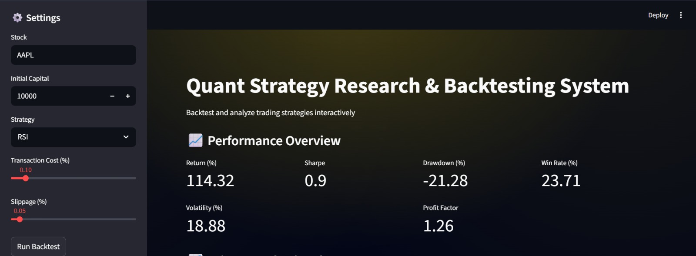
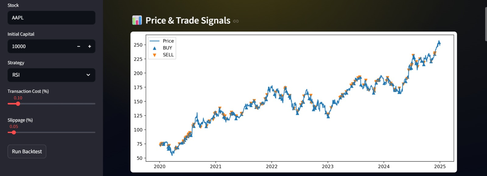
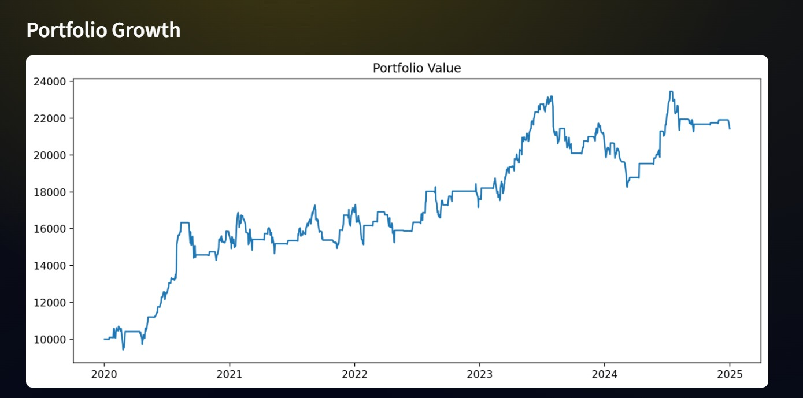
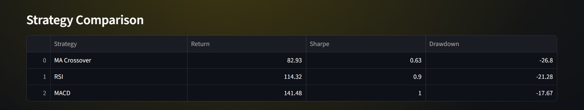
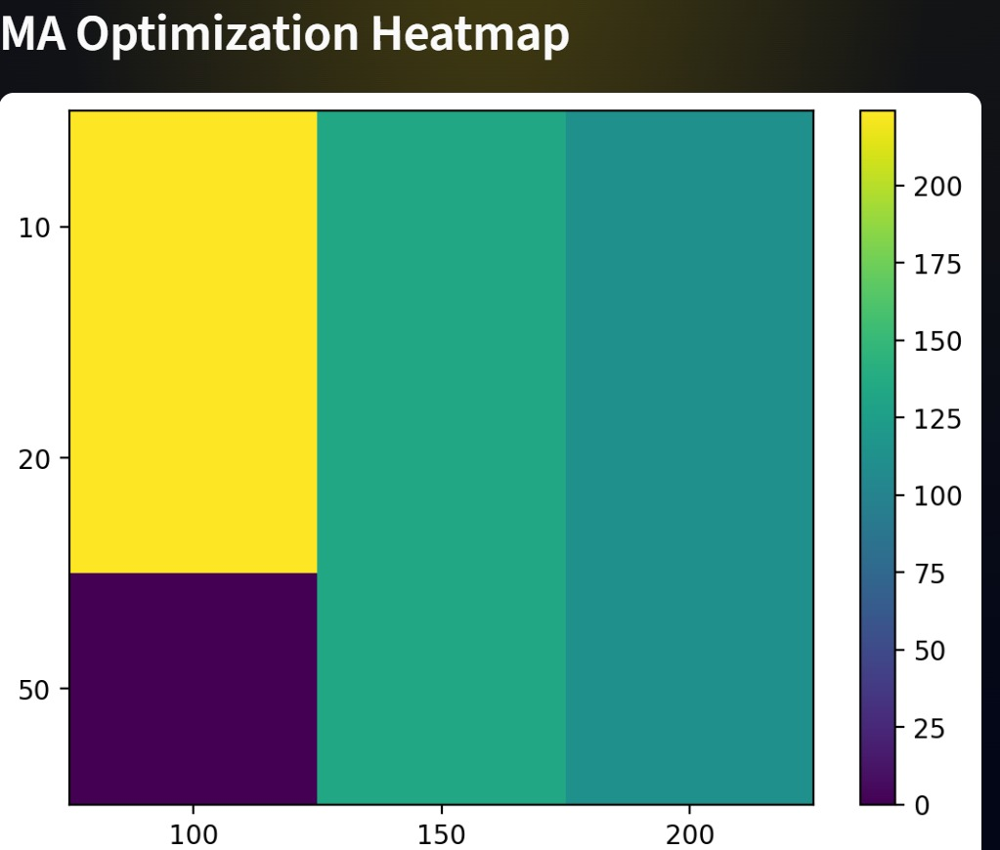

# QuantLab

### Quantitative Research & Backtesting Platform

QuantLab is a modular quantitative research platform designed to develop, evaluate, and compare systematic trading strategies using historical market data.

The project replicates a simplified quantitative research workflow used by trading firms and hedge funds, including signal generation, backtesting, risk analysis, parameter optimization, and out-of-sample validation.

## Live Dashboard

🚀 Try QuantLab Live:

[Launch QuantLab]https://vir1-quantlab.streamlit.app/

---

## Key Features

### Research Pipeline

* Historical market data acquisition
* Trading signal generation
* Portfolio simulation
* Performance evaluation
* Strategy comparison
* Parameter optimization
* Interactive dashboard visualization

---

## Implemented Strategies

### Moving Average Crossover

A trend-following strategy that generates buy and sell signals based on short-term and long-term moving average crossovers.

### Relative Strength Index (RSI)

A mean-reversion strategy that identifies overbought and oversold market conditions.

### MACD

A momentum-based strategy utilizing exponential moving average convergence and divergence.

---

## Quantitative Metrics

The platform evaluates strategy performance using industry-standard metrics:

| Metric           | Description                        |
| ---------------- | ---------------------------------- |
| Total Return     | Overall profitability              |
| Sharpe Ratio     | Risk-adjusted return               |
| Maximum Drawdown | Largest portfolio decline          |
| Win Rate         | Percentage of profitable trades    |
| Volatility       | Portfolio risk                     |
| Profit Factor    | Gross profit divided by gross loss |

---

## Realistic Backtesting Assumptions

Unlike simplistic educational backtests, QuantLab incorporates:

* Transaction Costs
* Slippage Modelling
* Capital Tracking
* Portfolio Growth Simulation

These features provide more realistic estimates of live trading performance.

---

## Parameter Optimization

The platform performs systematic parameter testing across multiple moving average combinations and visualizes performance using heatmaps.

Example research question:

> Which moving average pair produces the highest risk-adjusted return for a given asset?

---

## Train-Test Validation

To reduce overfitting risk, strategies can be evaluated using:

* In-Sample (Training) Data
* Out-of-Sample (Testing) Data

This mirrors the validation workflow commonly used in quantitative research environments.

---

## Interactive Dashboard

QuantLab includes an interactive Streamlit dashboard allowing users to:

* Select assets
* Select strategies
* Configure initial capital
* Analyze portfolio performance
* Visualize trading signals
* Compare strategy behavior

---

## Project Structure

```text
QuantLab
│
├── app.py                # Streamlit Dashboard
├── main.py               # Research Runner
│
├── data_loader.py        # Market Data Acquisition
├── indicators.py         # Technical Indicators
├── strategies.py         # Trading Strategies
├── backtester.py         # Portfolio Simulation
├── metrics.py            # Performance Metrics
├── research.py           # Strategy Research Engine
│
├── requirements.txt
├── README.md
└── screenshots/
```

## Installation

```bash
git clone https://github.com/TheV1R/QuantLab.git

cd QuantLab

pip install -r requirements.txt
```

## Running the Dashboard

```bash
streamlit run app.py
```

---

## Future Development

Planned upgrades include:

* Benchmark Comparison (SPY)
* Walk-Forward Optimization
* Market Regime Detection
* Portfolio Optimization
* Factor Research
* Machine Learning Alpha Models
* Multi-Asset Portfolio Construction

---

## Motivation

The objective of QuantLab is not simply to test indicators, but to build a structured framework for evaluating trading hypotheses using quantitative methods.

The project serves as a foundation for more advanced research in:

* Quantitative Finance
* Statistical Arbitrage
* Systematic Trading
* Portfolio Management
* Machine Learning for Finance

## Dashboard Preview



## Trade Signals



## Portfolio Performance



## Strategy Comparison



## Parameter Optimization



---

## Author

Kaushal Virwani

Aspiring Quantitative Researcher | Quantitative Finance Enthusiast

GitHub: https://github.com/TheV1R

